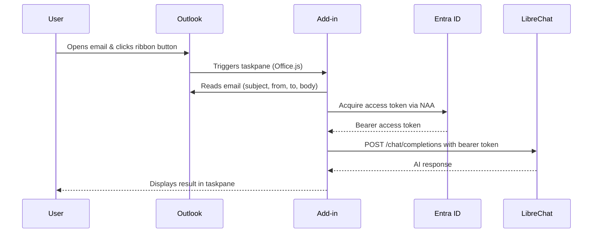

<div align="center">

# ✉️ LibreChat Outlook Add-in

**AI-powered email analysis, right inside Outlook.**

Summarize threads, draft replies, and extract action items — all from your inbox,
powered by your own [LibreChat](https://www.librechat.ai/) instance.

[](LICENSE)
[](https://nodejs.org/)
[](https://learn.microsoft.com/en-us/office/dev/add-ins/outlook/)
[](Dockerfile)

<br/>


</div>

<br/>

---

## ✨ Features

| Feature                        | Description                                                      |
| ------------------------------ | ---------------------------------------------------------------- |
| 📝 **One-click summarization** | Highlight key points, action items, and deadlines from any email |
| 💬 **AI-powered replies**      | Draft professional replies with a single click                   |
| 🎯 **Custom prompts**          | Add per-email instructions before generating a response          |
| 🌍 **Multilingual**            | Full UI in English and Portuguese (auto-detected)                |
| ⚙️ **White-label**             | App name and logo configurable via environment variables         |
| 📋 **Copy to clipboard**       | Instant one-click copy of any AI response                        |
| 🐳 **Docker-ready**            | Deploy anywhere with the included Dockerfile                     |

---

## 📋 Prerequisites

- **[Node.js](https://nodejs.org/)** v24 or later
- An **Outlook** client (Desktop, Web, or Mac) with add-in support
- A running **[LibreChat](https://www.librechat.ai/)** instance with an OpenAI-compatible API endpoint
- An Outlook client that supports **Nested App Authentication (NAA) 1.1** — Outlook on the web, Outlook for Windows version 2409 (build 18025.20000) or later, Outlook for Mac version 16.89 (build 24090815) or later, or the supported mobile clients

> [!IMPORTANT]
> NAA is not supported for Outlook.com or Gmail mailboxes. Older or unsupported Outlook clients cannot use this add-in because it has no API-key fallback.

---

## 🚀 Quick Start

### 1 · Install dependencies

```bash
npm install
```

### 2 · Configure environment

```bash
cp .env.example .env
```

Edit `.env` — at minimum set `LIBRECHAT_API_URL`. See [Environment Variables](#-environment-variables) for all options.

### 3 · Update the manifest

Before sideloading, edit `manifest.xml` to match your deployment. See [Manifest Configuration](#-manifest-configuration) for what to change.

### 4 · Start the dev server

```bash
npm start
```

The development server starts on **`https://localhost:3000`** with HTTPS.

### 5 · Sideload the add-in

<details>
<summary><strong>🌐 Outlook on the Web</strong></summary>

> [!WARNING]
> **Ad Blocker users:** You **must** disable your ad blocker (or add an exception) for the Outlook domain (e.g. `outlook.office.com`). The "Reply with AI" feature opens a compose window that ad blockers may silently block.

1. Go to [https://aka.ms/olksideload](https://aka.ms/olksideload) to open the **Add-Ins** panel
2. Navigate to **My add-ins**
3. Click **Add a custom add-in** → **Add from file**
4. Upload `manifest.xml`
</details>

<details>
<summary><strong>🖥️ Outlook Desktop (Windows)</strong></summary>

1. Open Outlook → **File** → **Manage Add-ins** (or **Get Add-ins**)
2. Click **My add-ins** → **+ Add a custom add-in** → **Add from file**
3. Select the `manifest.xml` file
</details>

<details>
<summary><strong>🍎 Outlook Desktop (Mac)</strong></summary>

1. Open Outlook → **Settings** → **Add-ins**
2. Click **+** → Choose `manifest.xml`
</details>

### 6 · Sign in automatically

1. Open any email in Outlook
2. Click the add-in button in the ribbon
3. The add-in signs you in through your organization's Microsoft Entra ID configuration

Once Entra and LibreChat are configured, no API key is required and there is nothing to paste into Settings.

---

## 🔧 Environment Variables

Copy `.env.example` to `.env` and fill in the values. All variables are optional during development, but the LibreChat URL and Entra settings are required for a working deployment.

| Variable             | Description                                                                                   | Default               |
| -------------------- | --------------------------------------------------------------------------------------------- | --------------------- |
| `LIBRECHAT_API_URL`  | Base URL of your LibreChat instance (no trailing slash)                                       | _(none)_              |
| `LIBRECHAT_AGENT_ID` | Default Agent / Assistant ID to pre-select                                                    | _(none)_              |
| `ENTRA_CLIENT_ID`    | Application (client) ID of the add-in's Entra SPA registration                                | _(none)_              |
| `ENTRA_TENANT_ID`    | Directory (tenant) ID used for the single-tenant Entra authority                              | _(none)_              |
| `ENTRA_API_SCOPE`    | Full delegated scope exposed by LibreChat, for example `api://<api-client-id>/access_as_user` | _(none)_              |
| `APP_NAME`           | Product name shown in the task pane header, title, and notification strings                   | `AI Assistant`        |
| `APP_LOGO_URL`       | Absolute URL to your logo for the task pane header                                            | bundled `icon-32.png` |
| `ICON_LABEL`         | Badge drawn on the main ribbon icon at runtime (`DEV`, `STB`, or empty)                       | _(none — production)_ |

> **Note:** `APP_NAME` controls all visible product-name references in the task pane UI at runtime. It does **not** update `manifest.xml` — that file is read by Outlook at install time and must be edited separately (see below).

> The LibreChat agent owns its persona and output contract (security analysis, summary, suggested reply). The add-in does not ship local system prompts — configure them on the agent itself.

---

## 🔐 Entra ID Setup

An administrator must configure two single-tenant app registrations: one SPA registration for this Outlook add-in and one API registration for LibreChat.

### 1. Register the Outlook add-in SPA

1. In **Microsoft Entra admin center → App registrations**, create or select the SPA registration for this add-in.
2. Under **Authentication**, add the NAA redirect URI as a **Single-page application** redirect URI:
   `brk-multihub://<add-in-origin>`
3. Copy the SPA registration's **Application (client) ID** into `ENTRA_CLIENT_ID`.
4. Copy the directory's **Directory (tenant) ID** into `ENTRA_TENANT_ID`.

Use the origin represented by the deployed add-in URL in the redirect URI. Keep the registration single-tenant and do not create a client secret for the SPA.

### 2. Expose and authorize the LibreChat API scope

1. In the LibreChat API app registration, open **Expose an API** and add the delegated scope `access_as_user`.
2. Use the resulting full scope URI as `ENTRA_API_SCOPE`, for example:
   `api://<librechat-api-client-id>/access_as_user`
3. In **Expose an API → Authorized client applications**, pre-authorize the Outlook add-in SPA by adding its client ID and selecting the `access_as_user` scope.
4. In the LibreChat API app registration manifest, set:
   `"accessTokenAcceptedVersion": 2`

> [!WARNING]
> Missing pre-authorization causes an unexpected consent prompt when the add-in tries to sign in. This is an app-registration problem, not an API-key problem.

> [!WARNING]
> `accessTokenAcceptedVersion: 1` causes LibreChat to reject the token with a confusing issuer-mismatch error and usually surfaces as HTTP 401. Set it to `2` on the LibreChat API registration.

### 3. Configure LibreChat OIDC validation

Add the OIDC block to the `librechat.yaml` configuration used by LibreChat. The `issuer` must be the tenant-specific Microsoft identity platform v2 issuer, and `audience` must be the LibreChat API application's client ID:

```yaml
endpoints:
  agents:
    remoteApi:
      auth:
        apiKey:
          enabled: false
        oidc:
          enabled: true
          issuer: https://login.microsoftonline.com/<tenant-id>/v2.0
          audience: <librechat-api-client-id>
```

The `audience` value is the API registration's client ID, not the full `api://.../access_as_user` scope URI. Restart LibreChat after changing this configuration.

### 4. Configure the add-in environment

Set the following values in `.env` for local development or in the deployment environment for production:

```bash
LIBRECHAT_API_URL=https://chat.example.com
LIBRECHAT_AGENT_ID=agent_xxxxx
ENTRA_CLIENT_ID=<outlook-add-in-spa-client-id>
ENTRA_TENANT_ID=<tenant-id>
ENTRA_API_SCOPE=api://<librechat-api-client-id>/access_as_user
```

The add-in acquires the access token silently through NAA and sends it as a bearer token to LibreChat. Users do not enter or store an API key in the add-in.

---

## 📝 Manifest Configuration

`manifest.xml` is read by Outlook **at install time** — it is not served by the add-in and cannot read environment variables. Before sideloading or deploying, open the file and update these fields:

| Field                                                    | Where in the file | What to set                                                                                                                       |
| -------------------------------------------------------- | ----------------- | --------------------------------------------------------------------------------------------------------------------------------- |
| `<Id>`                                                   | Line 9            | A unique GUID for your add-in. Generate one at [guidgenerator.com](https://guidgenerator.com) — **do not reuse the placeholder**. |
| `<ProviderName>`                                         | Line 11           | Your company or team name.                                                                                                        |
| `<DisplayName>`                                          | Line 13           | The name shown in the Outlook add-in list and ribbon tooltip.                                                                     |
| `<Description>`                                          | Line 14           | Short description shown in the add-in store/sideload UI.                                                                          |
| `<SupportUrl>`                                           | Line 19           | URL to your support page or repo.                                                                                                 |
| `<IconUrl>` / `<HighResolutionIconUrl>`                  | Lines 16–17       | Absolute URLs to your deployed `icon-64.png` / `icon-128.png`.                                                                    |
| `<AppDomain>`                                            | Line 22           | The domain where the add-in is hosted (must match your deployment URL).                                                           |
| All `<SourceLocation>` and `<bt:Url>` entries            | Lines 38, 239–243 | Replace `https://localhost:3000` with your actual deployment URL.                                                                 |
| All `<bt:Image>` entries                                 | Lines 222–236     | Replace `https://localhost:3000` with your actual deployment URL.                                                                 |
| Ribbon label strings (`GroupLabel`, `ComposeGroupLabel`) | Lines ~248–249    | Change `AI Assistant` to your product name if desired.                                                                            |

> [!IMPORTANT]
> Every `https://localhost:3000` placeholder in the manifest **must** be replaced with your actual HTTPS deployment URL before the add-in will load. Outlook will refuse to load resources from domains not listed in `<AppDomains>`.

---

## 🐳 Docker

```bash
docker build -t librechat-outlook-addin .
docker run -p 3000:3000 \
  -e LIBRECHAT_API_URL=https://chat.example.com \
  -e LIBRECHAT_AGENT_ID=your-agent-id \
  -e APP_NAME="My AI Assistant" \
  -e APP_LOGO_URL=https://yourcompany.com/logo.png \
  librechat-outlook-addin
```

---

## 📦 Build for Production

```bash
npm run build
```

Output goes to `dist/`. Deploy these static files to any HTTPS-enabled host, then update `manifest.xml` to point to that domain.

---

## ⚙️ How It Works



1. **Office.js** reads the selected email's metadata and body
2. The content is sent to your LibreChat instance via the **OpenAI-compatible `/chat/completions` endpoint**
3. The AI response is rendered (with Markdown support) in the taskpane

---

## 🔒 Security

| Concern                | Approach                                                                                                          |
| ---------------------- | ----------------------------------------------------------------------------------------------------------------- |
| **Authentication**     | Entra access tokens are acquired through NAA and sent as bearer tokens only to your configured LibreChat endpoint |
| **Credential storage** | The add-in does not request or store API keys; MSAL manages its token cache for the signed-in Entra account       |
| **HTML rendering**     | All API responses are sanitized with [DOMPurify](https://github.com/cure53/DOMPurify) before being rendered       |
| **Permissions**        | The add-in only requests `ReadWriteItem` — scoped to the current email                                            |
| **Network**            | All traffic goes directly to **your** LibreChat instance — no third-party services involved                       |

---

## 📄 License

This project is licensed under the [MIT License](LICENSE).
