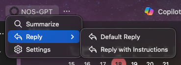
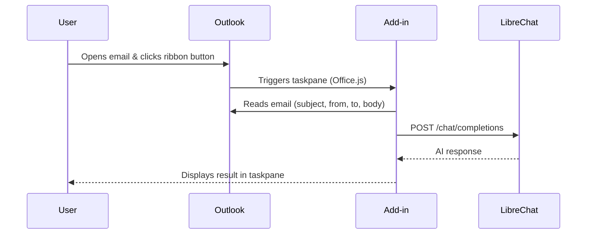

<div align="center">

# ✉️ LibreChat Outlook Add-in

**AI-powered email analysis, right inside Outlook.**

Summarize threads, draft replies, and extract action items — all from your inbox,
powered by your own [LibreChat](https://www.librechat.ai/) instance.

[](LICENSE)
[](https://nodejs.org/)
[](https://learn.microsoft.com/en-us/office/dev/add-ins/outlook/)
[](Dockerfile)

<br/>



</div>

<br/>

---

## ✨ Features

| Feature                        | Description                                                      |
| ------------------------------ | ---------------------------------------------------------------- |
| 📝 **One-click summarization** | Highlight key points, action items, and deadlines from any email |
| 💬 **AI-powered replies**      | Draft professional replies with a single click                   |
| 🎯 **Custom prompts**          | Add per-email instructions before generating a response          |
| 🌍 **Multilingual**            | Full UI in English and Portuguese (auto-detected)                |
| ⚙️ **White-label**             | App name and logo configurable via environment variables         |
| 📋 **Copy to clipboard**       | Instant one-click copy of any AI response                        |
| 🐳 **Docker-ready**            | Deploy anywhere with the included Dockerfile                     |

---

## 📋 Prerequisites

- **[Node.js](https://nodejs.org/)** v24 or later
- An **Outlook** client (Desktop, Web, or Mac) with add-in support
- A running **[LibreChat](https://www.librechat.ai/)** instance with an OpenAI-compatible API endpoint

---

## 🚀 Quick Start

### 1 · Install dependencies

```bash
npm install
```

### 2 · Configure environment

```bash
cp .env.example .env
```

Edit `.env` — at minimum set `LIBRECHAT_API_URL`. See [Environment Variables](#-environment-variables) for all options.

### 3 · Update the manifest

Before sideloading, edit `manifest.xml` to match your deployment. See [Manifest Configuration](#-manifest-configuration) for what to change.

### 4 · Start the dev server

```bash
npm start
```

The development server starts on **`https://localhost:3000`** with HTTPS.

### 5 · Sideload the add-in

<details>
<summary><strong>🌐 Outlook on the Web</strong></summary>

> [!WARNING]
> **Ad Blocker users:** You **must** disable your ad blocker (or add an exception) for the Outlook domain (e.g. `outlook.office.com`). The "Reply with AI" feature opens a compose window that ad blockers may silently block.

1. Go to [https://aka.ms/olksideload](https://aka.ms/olksideload) to open the **Add-Ins** panel
2. Navigate to **My add-ins**
3. Click **Add a custom add-in** → **Add from file**
4. Upload `manifest.xml`
</details>

<details>
<summary><strong>🖥️ Outlook Desktop (Windows)</strong></summary>

1. Open Outlook → **File** → **Manage Add-ins** (or **Get Add-ins**)
2. Click **My add-ins** → **+ Add a custom add-in** → **Add from file**
3. Select the `manifest.xml` file
</details>

<details>
<summary><strong>🍎 Outlook Desktop (Mac)</strong></summary>

1. Open Outlook → **Settings** → **Add-ins**
2. Click **+** → Choose `manifest.xml`
</details>

### 6 · Configure API access

1. Open any email in Outlook
2. Click the add-in button in the ribbon
3. Expand **Settings** and enter your API Key

4. Click **Save Settings** — you're ready to go!

---

## 🔧 Environment Variables

Copy `.env.example` to `.env` and fill in the values. All variables are optional except `LIBRECHAT_API_URL`.

| Variable                 | Description                                                                 | Default               |
| ------------------------ | --------------------------------------------------------------------------- | --------------------- |
| `LIBRECHAT_API_URL`      | Base URL of your LibreChat instance (no trailing slash)                     | _(none)_              |
| `LIBRECHAT_AGENT_ID`     | Default Agent / Assistant ID to pre-select                                  | _(none)_              |
| `LIBRECHAT_API_KEY_HELP` | Markdown string shown under the API Key field in Settings (supports links)  | _(auto-generated)_    |
| `APP_NAME`               | Product name shown in the task pane header, title, and notification strings | `AI Assistant`        |
| `APP_LOGO_URL`           | Absolute URL to your logo for the task pane header                          | bundled `icon-32.png` |
| `ICON_LABEL`             | Badge drawn on the main ribbon icon at runtime (`DEV`, `STB`, or empty)     | _(none — production)_ |

> **Note:** `APP_NAME` controls all visible product-name references in the task pane UI at runtime. It does **not** update `manifest.xml` — that file is read by Outlook at install time and must be edited separately (see below).

> The LibreChat agent owns its persona and output contract (security analysis, summary, suggested reply). The add-in does not ship local system prompts — configure them on the agent itself.

---

## 📝 Manifest Configuration

`manifest.xml` is read by Outlook **at install time** — it is not served by the add-in and cannot read environment variables. Before sideloading or deploying, open the file and update these fields:

| Field                                                    | Where in the file | What to set                                                                                                                       |
| -------------------------------------------------------- | ----------------- | --------------------------------------------------------------------------------------------------------------------------------- |
| `<Id>`                                                   | Line 9            | A unique GUID for your add-in. Generate one at [guidgenerator.com](https://guidgenerator.com) — **do not reuse the placeholder**. |
| `<ProviderName>`                                         | Line 11           | Your company or team name.                                                                                                        |
| `<DisplayName>`                                          | Line 13           | The name shown in the Outlook add-in list and ribbon tooltip.                                                                     |
| `<Description>`                                          | Line 14           | Short description shown in the add-in store/sideload UI.                                                                          |
| `<SupportUrl>`                                           | Line 19           | URL to your support page or repo.                                                                                                 |
| `<IconUrl>` / `<HighResolutionIconUrl>`                  | Lines 16–17       | Absolute URLs to your deployed `icon-64.png` / `icon-128.png`.                                                                    |
| `<AppDomain>`                                            | Line 22           | The domain where the add-in is hosted (must match your deployment URL).                                                           |
| All `<SourceLocation>` and `<bt:Url>` entries            | Lines 38, 239–243 | Replace `https://localhost:3000` with your actual deployment URL.                                                                 |
| All `<bt:Image>` entries                                 | Lines 222–236     | Replace `https://localhost:3000` with your actual deployment URL.                                                                 |
| Ribbon label strings (`GroupLabel`, `ComposeGroupLabel`) | Lines ~248–249    | Change `AI Assistant` to your product name if desired.                                                                            |

> [!IMPORTANT]
> Every `https://localhost:3000` placeholder in the manifest **must** be replaced with your actual HTTPS deployment URL before the add-in will load. Outlook will refuse to load resources from domains not listed in `<AppDomains>`.

---

## 🐳 Docker

```bash
docker build -t librechat-outlook-addin .
docker run -p 3000:3000 \
  -e LIBRECHAT_API_URL=https://chat.example.com \
  -e LIBRECHAT_AGENT_ID=your-agent-id \
  -e APP_NAME="My AI Assistant" \
  -e APP_LOGO_URL=https://yourcompany.com/logo.png \
  librechat-outlook-addin
```

---

## 📦 Build for Production

```bash
npm run build
```

Output goes to `dist/`. Deploy these static files to any HTTPS-enabled host, then update `manifest.xml` to point to that domain.

---

## ⚙️ How It Works



1. **Office.js** reads the selected email's metadata and body
2. The content is sent to your LibreChat instance via the **OpenAI-compatible `/chat/completions` endpoint**
3. The AI response is rendered (with Markdown support) in the taskpane

---

## 🔒 Security

| Concern             | How it's handled                                                                                                |
| ------------------- | --------------------------------------------------------------------------------------------------------------- |
| **API key storage** | Stored in Outlook roaming settings — never leaves your machine except for API calls to your configured endpoint |
| **HTML rendering**  | All API responses are sanitized with [DOMPurify](https://github.com/cure53/DOMPurify) before being rendered     |
| **Permissions**     | The add-in only requests `ReadWriteItem` — scoped to the current email                                          |
| **Network**         | All traffic goes directly to **your** LibreChat instance — no third-party services involved                     |

---

## 📄 License

This project is licensed under the [MIT License](LICENSE).
