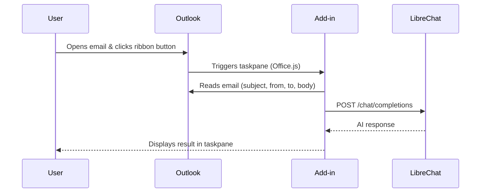

# LibreChat Outlook Add-in

AI-powered email analysis, right inside Outlook.

## Overview

LibreChat Outlook Add-in enables users to summarize email threads, draft AI-powered replies, and extract action items — all from within Microsoft Outlook, powered by a [LibreChat](https://www.librechat.ai/) instance.

## Features

| Feature                     | Description                                                      |
| --------------------------- | ---------------------------------------------------------------- |
| **One-click summarization** | Highlight key points, action items, and deadlines from any email |
| **AI-powered replies**      | Draft professional replies with a single click                   |
| **Custom prompts**          | Add per-email instructions before generating a response          |
| **Multilingual**            | Full UI in English and Portuguese (auto-detected)                |
| **Configurable**            | Set your API URL, API key, model, and system prompts             |
| **Copy to clipboard**       | Instant one-click copy of any AI response                        |
| **Docker-ready**            | Deploy anywhere with the included Dockerfile                     |

## Architecture



## Project Structure

```
librechat-outlook-addin/
├── manifest.xml                  # Outlook add-in manifest
├── Dockerfile                    # Multi-stage Docker build
├── webpack.config.js             # Webpack config (dev server + build)
├── package.json
├── assets/                       # Add-in ribbon icons
└── src/
    ├── i18n.js                   # Internationalization (EN / PT)
    ├── taskpane/                 # Taskpane UI and core logic
    ├── commands/                 # Ribbon button handlers
    └── dialogs/                  # Custom prompt dialog
```

## Getting Started

### Prerequisites

- **Node.js** v18 or later
- An **Outlook** client with add-in support
- A running **LibreChat** instance with an OpenAI-compatible API endpoint

### Quick Start

```bash
npm install
npm start
```

The development server starts on `https://localhost:3000` with HTTPS.

### Docker

```bash
docker build -t librechat-outlook-addin .
docker run -p 3000:3000 librechat-outlook-addin
```

## Environment Variables

| Variable             | Description                    | Default                       |
| -------------------- | ------------------------------ | ----------------------------- |
| `LIBRECHAT_API_URL`  | Base URL for the LibreChat API | _(none — set in Settings UI)_ |
| `LIBRECHAT_AGENT_ID` | Agent / Assistant ID to use    | _(none)_                      |

> The LibreChat agent owns its persona and output contract (security analysis, summary, suggested reply). The add-in does not ship local system prompts — configure them on the agent itself.
